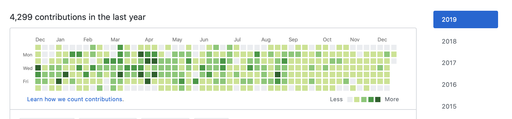
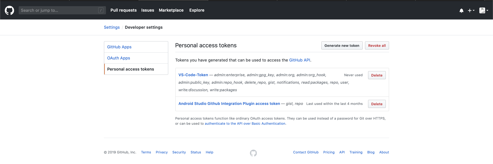

# How to be lazy : 101
### So they said, people check your github projects while recruiting into good places.

They also said, having a green github profile helps. So naturally, there must be some way to work around having to do the same, with zero effort. 

A bit of googling led me to this idea, just make a stupid script for it, and run it.

And voila, this was born.

#### PS: Unless you want people to see random stuff this prints, I'd rather keep the repo to which this script pushes as private.

Usage:
```
git clone https://github.com/nullpointxr/repoToKeepGithubGreen.git

cd repoToKeepGithubGreen
```
Now copy the script to a repo which you'd rather keep as private. 
```
cp githubAddCommitPushScript.py path/to/your/repo

cp quotes.json path/to/your/repo
```
Change the parameters, as you wish.

```
python githubAddCommitPushScript.py
```
And poof, your github profile should be green, for that day.



##### I'll convert this to a script that executes on startup soon, if you're thaaaat lazy

#### I'm assuming that you have enabled automatic login via [personal access tokens](https://github.com/settings/tokens)


